# 1. open [launchpad](http://localhost:3000/)

1. click the button, start the deposit process  
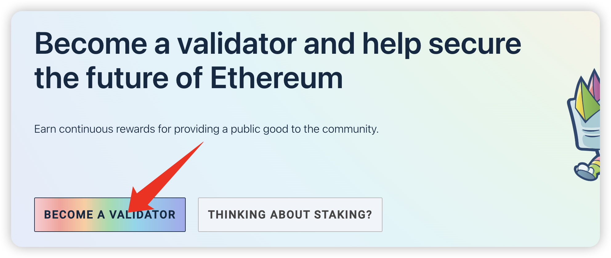

2. read the deposit notice
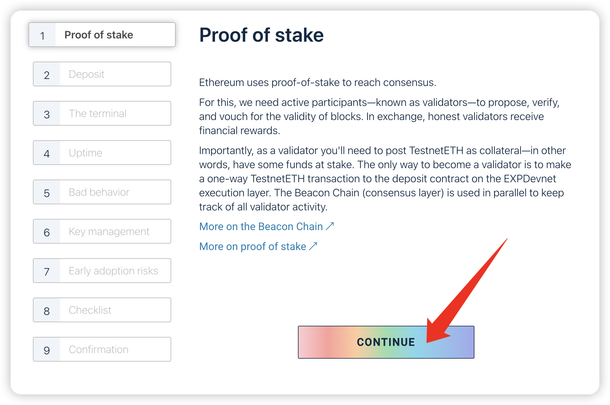

3. select cl client, need to use geth
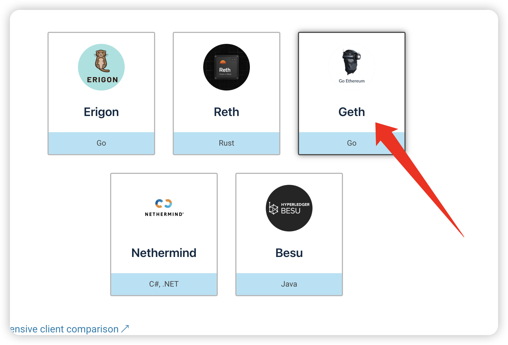

4. click continue
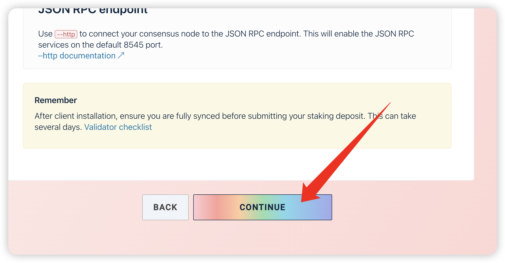

5. select el client, need to use lighthouse
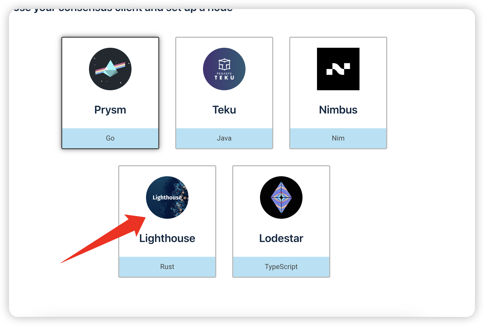

6. click continue
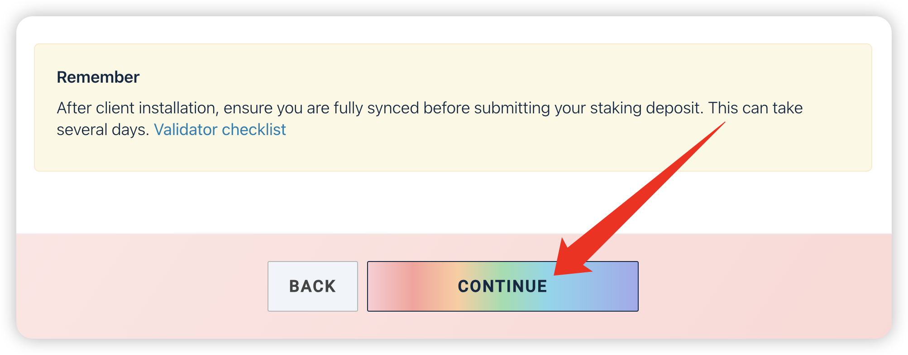

7. download [deposit cli](https://github.com/ethereum/staking-deposit-cli/releases)
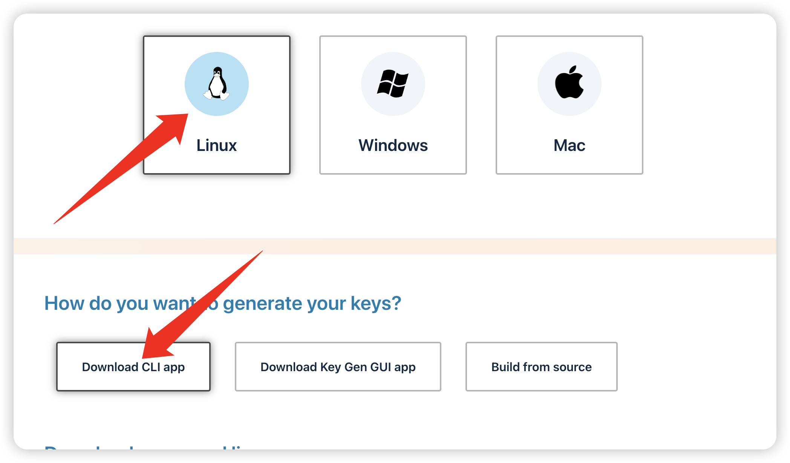

# 2. generate deposit data
1. run cli 
```
deposit new-mnemonic --num_validators 1
```
2. select the language you can understand
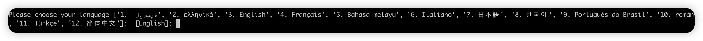

3. select the mnemonic language
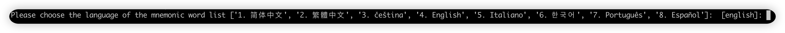

4. select the network, only can select mainnet


5. input the password for creating keystore
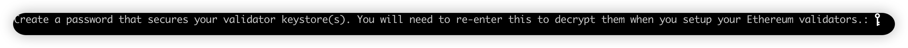

6. input the password for creating keystore again


7. save your mnemonic
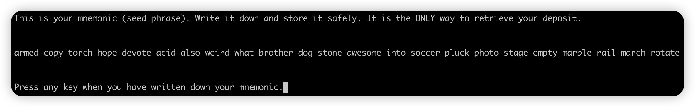

8. input your mnemonic again
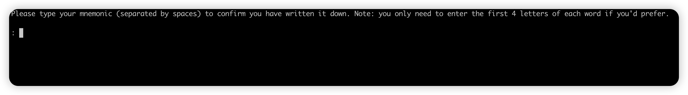

9. check the deposit data file
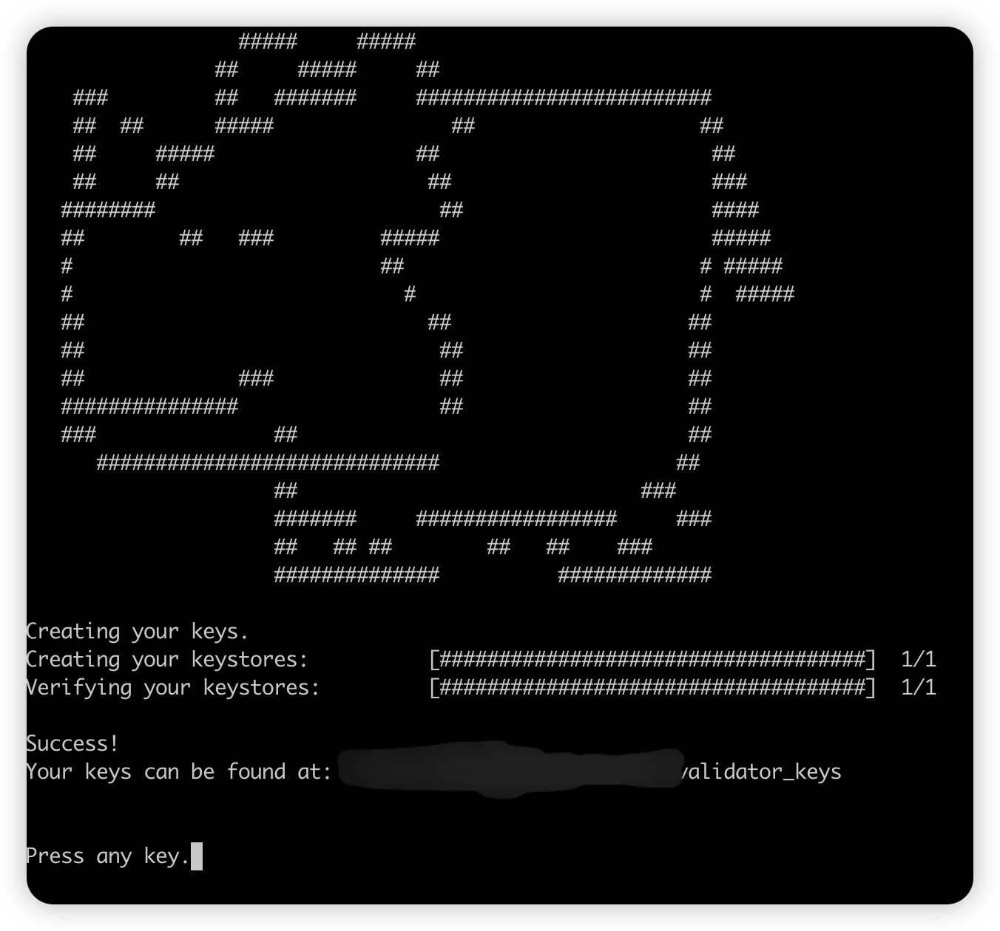

10. upload the deposit data file to the launchpad
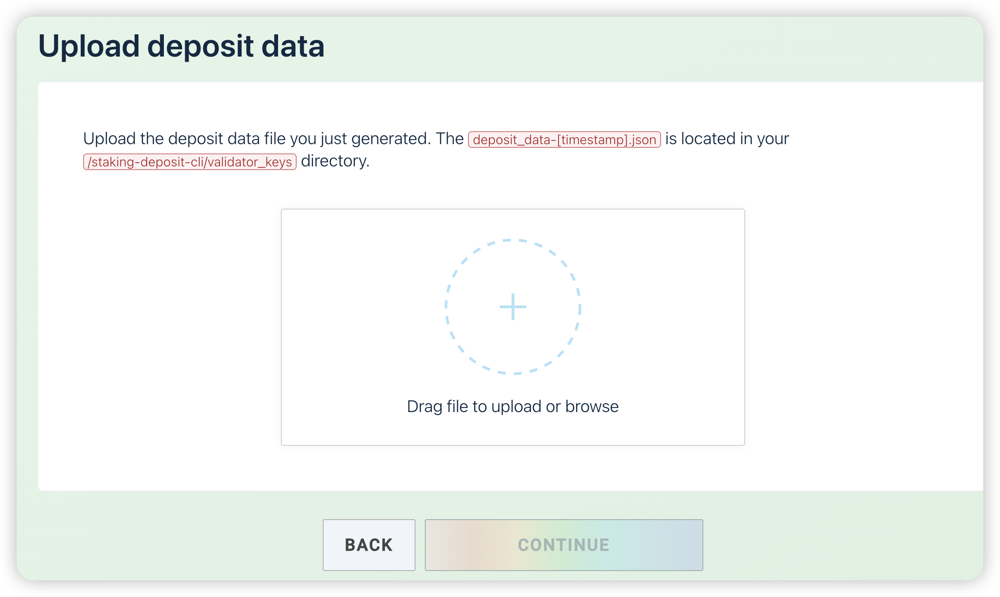

11. connect metamask
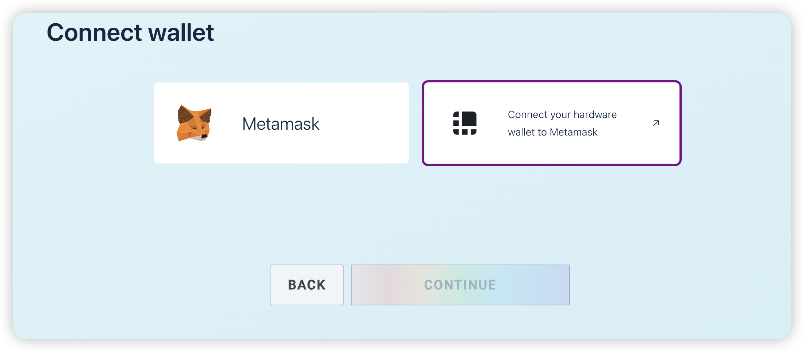

12. deposit
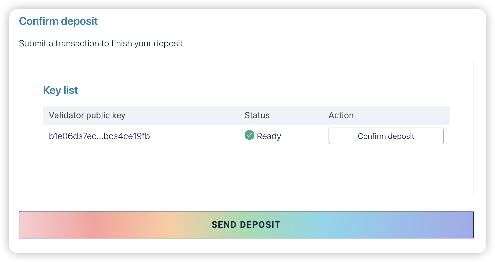

# 3. start the node
1.run node
```
export EXP_NODE_DATA_DIR="${PWD}/data"
export EXP_NODE_BIN_E_CLIENT="${PWD}/exp-e-client"
export EXP_NODE_BIN_C_CLIENT="${PWD}/exp-c-client"
export EXP_NODE_BIN_SCD="${PWD}/scd"
export EXP_NODE_BIN_EXPANDER="${PWD}/expander-exec"
export EXP_NODE_GENESIS="${PWD}/genesis_testnet"
export EXP_NODE_PEER="10.128.15.210"
sudo apt install mpich
sudo cp ${EXP_NODE_BIN_EXPANDER} /usr/local/bin/

./join_node.sh
```

2. import validator
```
${PWD}/exp-c-client validator_manager import --keystore-file=keystore-m_12381_3600_0_0_0-1735093940.json --password='12345678' --vc-token=${EXP_NODE_DATA_DIR}/cl/vc/validators/api-token.txt --vc-url=http://127.0.0.1:5062
```

3. check the validator
```
${PWD}/exp-c-client validator_manager list --vc-token=${EXP_NODE_DATA_DIR}/cl/vc/validators/api-token.txt --vc-url=http://127.0.0.1:5062
```

# 4. exit validator
```
${PWD}/exp-c-client account validator exit --testnet-dir=${EXP_NODE_DATA_DIR}/genesis --datadir=${EXP_NODE_DATA_DIR}/cl/vc --keystore=keystore-m_12381_3600_0_0_0-1735093940.json --beacon-node=http://127.0.0.1:5052
```
1. input the password of keystore file
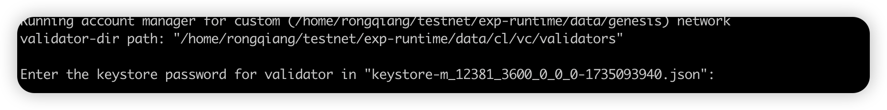

2. input 'Exit my validator'
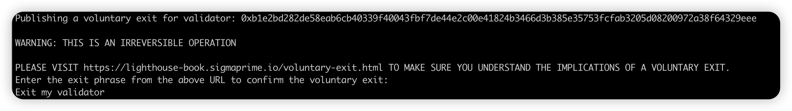

3. wait for exit
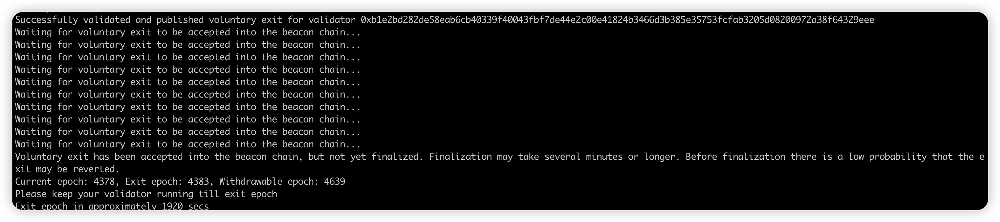
